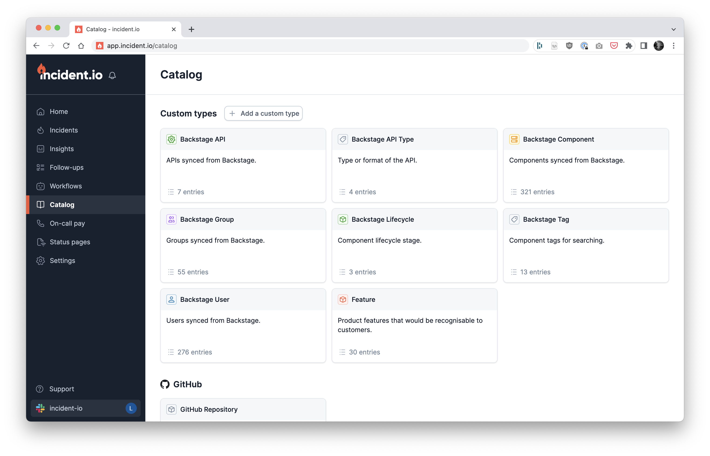

# Catalog importer

This is the official catalog importer for the [incident.io](https://incident.io/)
catalog. It's can be used to sync catalog data from sources like local files or
GitHub and push them into the incident.io catalog.



## Getting started

macOS users can install the catalog using brew:

```console
brew tap incident-io/homebrew-taps
brew install catalog-importer
```

Otherwise, ensure that the go runtime is installed and then:

```console
go install github.com/incident-io/catalog-importer/cmd/catalog-importer@latest
```

Once installed, see [documentation](docs) for example catalogs and CI config.

## Using Docker

A Docker image is available for containerised environments; see [Docker
Hub][hub] for more details of the image and available tags.

[hub]: https://hub.docker.com/r/incidentio/catalog-importer/tags

You may wish to deploy this on a scheduled basis to sync your catalog data. To do
that, you'll need to ensure that the necessary configuration is mounted into the
container and that the API key is supplied as an environment variable.

```console
docker run \
    -v $(pwd)/docs/simple:/config --workdir /config \
    -e 'INCIDENT_API_KEY=<key>' \
    --rm -it \
    incidentio/catalog-importer:latest \
    sync --config /config/importer.jsonnet
```

## Contributing

We're happy to accept open-source contributions or feedback. Just open a
PR/issue and we'll get back to you. This repo contains details on
[how to get started with local development](./development.md).
