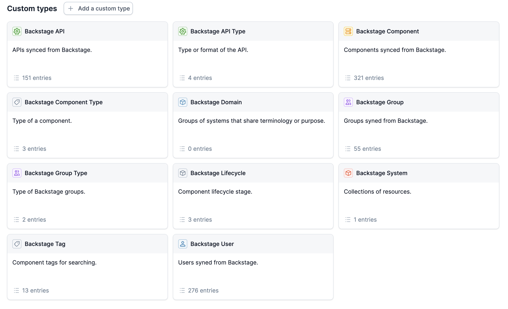

# Backstage

The `importer.jsonnet` file is intended to be used with the incident.io
catalog-importer to import Backstage catalog data.

Out the box, this will sync catalog types for:



See documentation on how to use the importer at:

- https://github.com/incident-io/catalog-importer/tree/master/docs

Otherwise get started below.

## Getting started

### 1. Install the catalog-importer:

```console
brew tap incident-io/homebrew-taps
brew install catalog-importer
```

### 2. Create an API key

Create an API key from https://app.incident.io/settings/api-keys with the
following scopes:

- Can view data, like public incidents and organization settings
- Can manage organization settings (e.g. custom fields)

Then set that token as your `INCIDENT_API_KEY` environment variable.

### 3. Sync

Now you can run a sync to import your data into the incident catalog.

```console
$ export INCIDENT_API_KEY="<token-from-above>"
$ catalog-importer sync --config importer.jsonnet --allow-delete-all

✔ Loaded config (5 pipelines, 10 sources, 5 outputs)
✔ Connected to incident.io API (https://api.incident.io/)
✔ Found 29 catalog types, with 12 that match our sync ID (backstage)

...
```

This will create Backstage catalog entries from the sample `catalog-info.yaml`
file that we've included as an example to get people started.

### 4. Use your real data

To use real data, edit the `sources` in `pipelines/entries.jsonnet` to pull your
data from one of the following sources:

- `backstage` for directly from the Backstage API, if the importer can reach it
- `github` for sourcing catalog-info.yaml files across your organization
- `local` if you have catalog-info.yaml files locally on your filesystem
- `exec` to run a script that can build the catalog data

See more details at [Sources](../sources.md) and get in touch with
support@incident.io if you're having trouble.

## Customising for your annotations

Most organizations store custom config inside annotations of Backstage catalog
types, enriching the default Backstage types for their own uses.

If you use GitHub, you might want to tag each Backstage user with their GitHub
handle, like so:

```yaml
apiVersion: backstage.io/v1alpha1
kind: User
metadata:
  annotations:
    github.com/user-login: lawrencejones
  name: lawrence
spec:
  memberOf:
    - engineering
  profile:
    displayName: Lawrence Jones
    email: lawrence@incident.io
```

If you want to load this into the incident.io catalog, you can amend the output
(see pipelines/entries.jsonnet) to add a new attribute:

```jsonnet
{
  name: 'Backstage User',
  description: 'Users synced from Backstage.',
  type_name: 'Custom["BackstageUser"]',
  source: {
    // ...
  },
  attributes: [
    // ...
    {
      id: 'github',
      name: 'GitHub',
      type: 'String',
      source: 'annotations["github.com/user-login"]',
    },
  ],
}
```
